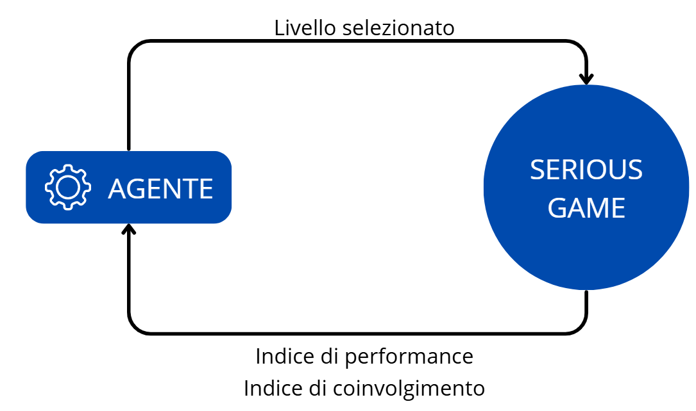

# ITA OVERVIEW - Tesi di Laurea Magistrale
Questa repository raccoglie la struttura e la metodologia utilizzata per la mia tesi di Laurea Magistrale.

*NOTA: Questa pagina ha solo uno scopo di mostrare l'architettura e l'approccio ingegneristico utilizzato.*

## Il Problema Clinico e l'Obiettivo
La scrittura è un'abilità fondamentale, che tipicamente viene padroneggiata al terzo anno delle scuole elementari. D’altra parte, alcuni studenti possono avere delle difficoltà, causate ad esempio da disturbi specifici dell’apprendimento o semplici ritardi temporanei. Queste difficoltà spesso non vengono riconosciute, a causa di mancanza di dati oggettivi e risorse limitate per il riconoscimento precoce. Possono portare gli studenti a non rispecchiare le aspettative scolastiche causando un senso di frustrazione e bassa autostima. 

Le tecnologie, e in particolare i serious game - cioè videogiochi sviluppati per altri scopi oltre all'intrattenimento - possono supportare gli studenti offrendo attività personalizzate più coinvolgenti, eventualmente di potenziamento e migliorare la salute mentale. La loro efficacia, d’altra parte, dipende dall’**aderenza** e dall’**ingaggio** dello studente, ma sostenerli nel tempo è una sfida ancora aperta. 

Lo scopo di questa tesi è stato quello di sviluppare un sistema **data-driven** basato su Reinforcement Learning in grado di massimizzare le prestazioni in un serious game che offre un potenziamento di scrittura, mantenendo un alto livello di coinvolgimento nell'utente.

## Architettura del Sistema
### Reinforcement Learning
Per tale scopo, è stato scelto di utilizzare un approccio di Reinforcement Learning basato su **Multi-Armed Bandit vincolato** (constrained MAB). 

Questo specifico approccio non si limita solo a massimizzare le prestazioni del giocatore, ma introduce un **vincolo matematico** basato sui dati che possono rappresentare il coinvolgimento dell'utente. 
* **Obiettivo prinicipale**: una volta definita una **metrica di performance** (una feature che può misurare in modo quantitativo quanto efficientemente un giocatore ha completato un livello), il decisore sceglie un livello volto a migliorare questa metrica e di conseguenza il tratto di scrittura.
* **Introduzione di un vincolo quantitativo**: viene definita una **metrica di coinvolgimento** (una feature  del gioco che può quantificare l'ingaggio dell'utente - tempi di inattività). L'obiettivo dell'algoritmo è quindi quello di **massimizzare** la metrica di performance **rispettando il vincolo**, in modo che rientri sempre sotto una **soglia di sicurezza**. In tal modo, se i dati (aggiornati online) indicano che l'attenzione del giocatore sta scendendo (tempo di inattività aumenta), l'agente cambia subito la sua politica decisionale, prevenendo l'abbandono dell'attività.

Il constrained MAB, inoltre, permette di avere un bilanciamento **in tempo reale** tra: 
1. **Esplorazione**: propone livelli di difficoltà tra tutti quelli disponibili per mappare le abilità e le risposte dell'utente;
2. **Sfruttamento**: propone il livello, stimato come ottimale, che massimizza le prestazioni e il coinvolgimento del giocatore.

### Modello
 

  

 

L'algoritmo segue questi 4 passaggi:
1. **Esecuzione dell'esercizio**: il giocatore esegue il livello proposto;
2. **Feedback dell'utente**: al termine di ogni livello, il gioco registra e invia all'agente RL due tipologie di dati: 
   * quanto l'esercizio è andato bene: indice di performance;
   * quanto è rimasto coinvolto il giocatore: indice di coinvolgimento,
3. **Decisione dell'algoritmo**: sulla base dei dati ottenuti e dello storico dei livelli precedenti, l'algoritmo sceglie, a seconda della sua strategia di decisione (policy), quale livello è il migliore per l'utente;
4. **Adattamento del gioco**: il gioco viene aggiornato proponendo la nuova sfida **adattata** al giocatore.

## Tecnologie e Competenze Sviluppate
Il progetto ha richiesto un background multidisciplinare: 
1. **Letteratura scientifica**: 
   * Revisione della letteratura: esame critico delle pubblicazioni scientifiche sia in ambito clinico (difficoltà della scrittura) sia in ambito computazionale (algoritmi di RL) per definire l'architettura ottimale del framework.
2. **Linguaggio principale**: **Python** per la gestione dei dati e la struttura vera e propria degli algoritmi;
  * **Librerie**:
    * Pandas e NumPy: per la manipolazione di serie e dati strutturati;
    * Scikit-learn: pipeline di preprocessing dati;
    * SciPy: per analisi statistica;
    * Matplotlib e Seaborn: per la visualizzazione dei risultati e dell'evoluzione delle metriche.
3. **Version control**: **Git/GitHub** per la gestione dello sviluppo software.

    
